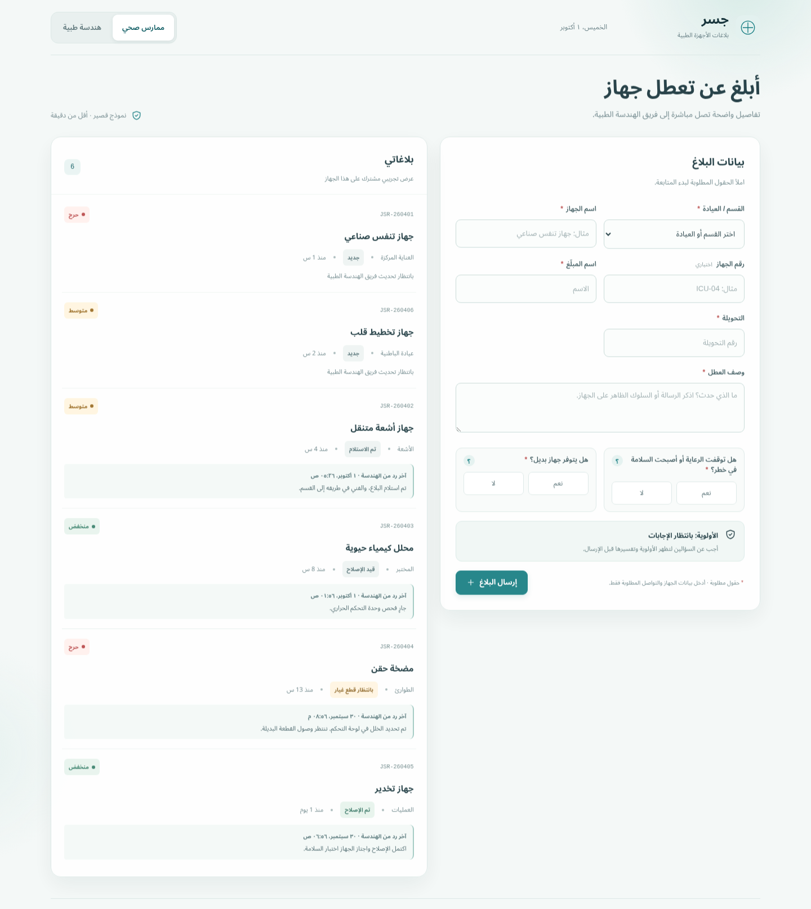
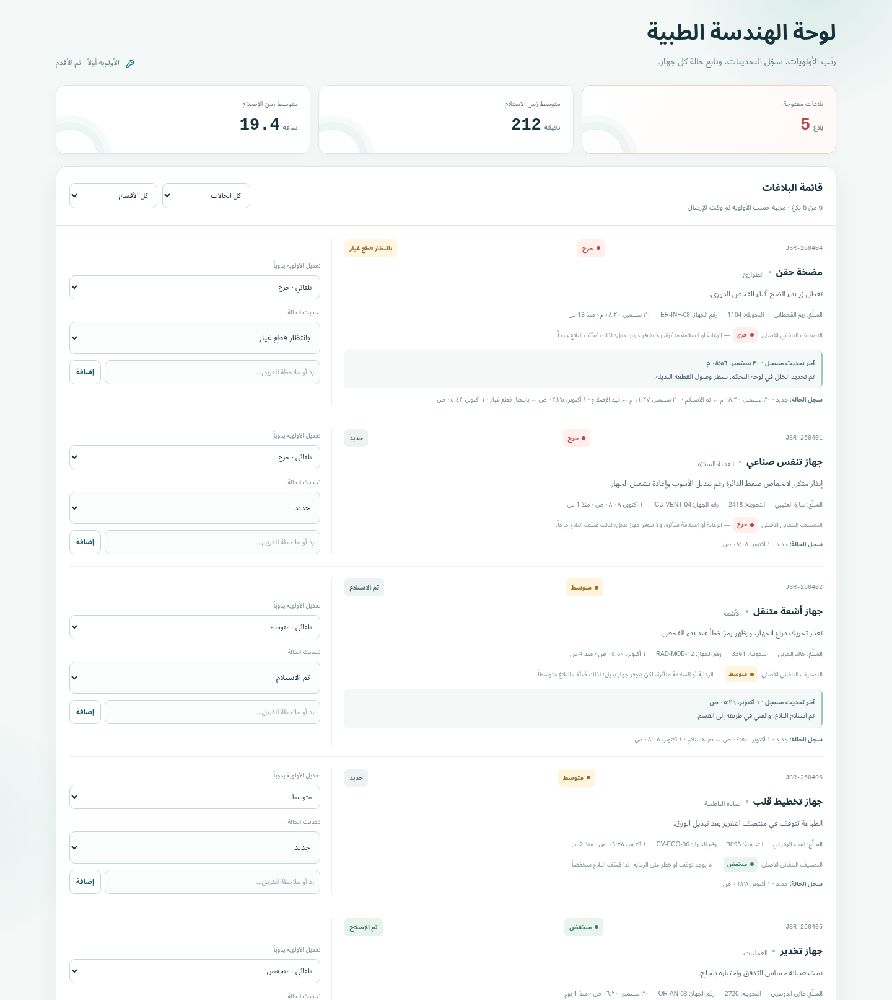

# جسر — بلاغات الأجهزة الطبية

جسر منصة عربية لتنسيق بلاغات أعطال الأجهزة الطبية بين الممارسين الصحيين والهندسة الطبية. تتيح تسجيل البلاغ وتقدير أولويته ومتابعة حالته وردود الفريق الهندسي.

الموقع المباشر: https://rio-xx.github.io/jisr/

أُعدّ المشروع ضمن برنامج **الذكاء الاصطناعي لرفع الإنتاجية** من أكاديمية سدايا. حساب الأكاديمية على GitHub: [SDAIAAcademy](https://github.com/SDAIAAcademy)

## المشكلة

- يبدأ التبليغ غالباً باتصال أو تحويلة، من دون سجل موحد لتفاصيل العطل.
- يعتمد تحديد الأولوية على التقدير اليدوي، ما قد يؤدي إلى اختلاف طريقة الفرز.
- يتطلب الاستفسار عن حالة الجهاز متابعةً بالاتصال بين القسم والهندسة الطبية.
- قد تصل تحديثات الإصلاح شفهياً، ولا يتوفر سجل واضح لزمن الاستجابة ومسار الحالة.

## الحل

| الجانب | الوضع الحالي (As-Is) | الوضع المستهدف (To-Be) |
|---|---|---|
| التبليغ | اتصال أو تحويلة | تسجيل البلاغ عبر المنصة |
| تحديد الأولوية | تصنيف يدوي | تصنيف آلي وفق إجابات موحدة |
| متابعة البلاغ | اتصالات للاستفسار عن الحالة | متابعة البلاغ وتحديثاته في المنصة |
| الإشعار | إشعار شفهي | تحديث الحالة في المنصة |
| زمن الاستلام | نحو 4 ساعات تقديرياً | 30 دقيقة للبلاغات الحرجة |
| زمن الإصلاح | من 2 إلى 3 أيام تقديرياً | يوم واحد |

أرقام الوضع الحالي تقديرية من واقع العمل، والمستهدف هدف مستقبلي؛ لا تمثل هذه الأرقام قياساً تشغيلياً أو ضماناً زمنياً في النموذج الحالي.

## مؤشرات الأداء

تحسب لوحة الهندسة الطبية المؤشرات تلقائياً من سجل كل بلاغ:

- **البلاغات المفتوحة:** كل بلاغ لم يصل إلى حالة «تم الإصلاح».
- **متوسط زمن الاستلام:** من إرسال البلاغ إلى أول تغيير في حالته.
- **متوسط زمن الإصلاح:** من إرسال البلاغ إلى «تم الإصلاح».

بعد أسبوعين من الاستخدام الفعلي، تُستبدل الأرقام التقديرية في جدول الحل بالقياس الفعلي.

## مزايا الواجهات

### الممارس الصحي

- إنشاء بلاغ يتضمن القسم والجهاز ووصف العطل ومعلومات التواصل.
- رؤية درجة الأولوية وسببها قبل إرسال البلاغ.
- مراجعة البلاغات وحالاتها وآخر رد من الهندسة الطبية.

### الهندسة الطبية

- مراجعة البلاغات مرتبة حسب الأولوية ثم وقت الإرسال، مع مؤشرات زمنية.
- تصفية القائمة حسب الحالة والقسم، وتعديل الأولوية يدوياً عند الحاجة.
- اختيار الحالة المناسبة مباشرةً، مع تسجيل التغييرات وأوقاتها.
- إضافة رد أو ملاحظة تظهر ضمن سجل البلاغ.

## قواعد التصنيف الآلي

| أثر العطل على الرعاية أو السلامة | توفر جهاز بديل | الأولوية |
|---|---|---|
| نعم | لا | **حرج** |
| نعم | نعم | **متوسط** |
| لا | نعم أو لا | **منخفض** |

يبقى التصنيف الآلي الأصلي ظاهراً حتى لو عدّلت الهندسة الطبية الأولوية، فالقرار النهائي للمختص.

## التشغيل والاستخدام

افتح `index.html` في المتصفح مباشرة، أو استخدم الموقع المباشر. لا يحتاج المشروع أي تثبيت.

1. اختر واجهة **ممارس صحي**، ثم أدخل بيانات الجهاز والقسم والتواصل ووصف العطل.
2. أجب عن سؤالي السلامة وتوفر البديل، وراجع التصنيف وسببه قبل الإرسال.
3. افتح واجهة **هندسة طبية** لمراجعة البلاغات وتصفية القائمة وتحديث الحالة أو إضافة رد.
4. للعرض، افتح الموقع في تبويبين واختر دور الممارس في أحدهما والهندسة الطبية في الآخر؛ حدّث التبويب الآخر بعد التعديل لرؤية أحدث البيانات.

## صور الواجهات

### الممارس الصحي



### الهندسة الطبية



## الخصوصية

لا يحتوي النموذج على حقول لبيانات المرضى؛ لا تُدخل بيانات مرضى أو معلومات حساسة في وصف العطل. تُحفظ البلاغات محلياً في `localStorage` على المتصفح والجهاز الحاليين فقط، ولا تتم مزامنتها مع أجهزة أو مستخدمين آخرين.

## التقنيات

HTML وCSS وJavaScript فقط، بدون أطر عمل أو خادم أو قاعدة بيانات، ومنشور عبر GitHub Pages.

## بنية المشروع

```text
.
├── index.html
├── favicon.svg
├── css/
│   └── styles.css
├── js/
│   └── app.js
├── docs/
│   └── TECHNICAL.md
├── assets/
│   └── screenshots/
├── README.md
├── CHANGELOG.md
└── LICENSE
```

## التوثيق

- التوثيق الفني: [docs/TECHNICAL.md](docs/TECHNICAL.md)، ويشمل البنية ومخطط البيانات وقواعد التصنيف وحساب المؤشرات.
- سجل التغييرات: [CHANGELOG.md](CHANGELOG.md)

## إدارة الإصدارات

يتبع المشروع الإصدار الدلالي (Semantic Versioning)، ورسائل commit بصيغة ثابتة: `feat` للمزايا، و`fix` للإصلاحات، و`docs` للتوثيق، و`chore` للإعدادات. الإصدارات منشورة في [صفحة Releases](https://github.com/Rio-xx/jisr/releases)، وكل إصدار جديد يُوثّق في CHANGELOG.

## كيف بُني المشروع

بُني بأسلوب Vibe Coding ضمن اليوم الثالث من البرنامج:

1. كتابة وثيقة المتطلبات (PRD) بمحاور: المشكلة، المستخدمون، الوظائف، التصميم، النجاح.
2. تحويل الـPRD إلى برومبت احترافي باستخدام Prompt Maker.
3. بناء التطبيق في Replit، ثم مراجعة المخرجات واختبارها وإصلاحها على مراحل.
4. الرفع على GitHub بمساعدة Claude Code، والنشر عبر GitHub Pages.

## القيود والخطوات القادمة

الإصدار الحالي نموذج أولي محلي، وليس نظاماً تشغيلياً أو قناة تنبيه، ولا يوفر حسابات أو مزامنة أو إشعارات.

- إضافة قاعدة بيانات مشتركة لمزامنة البلاغات بين الأجهزة.
- إضافة تسجيل دخول وصلاحيات للممارسين وفرق الهندسة الطبية.
- إرسال إشعارات عند إنشاء بلاغ أو تغيير حالته.
- دراسة تصنيف مدعوم بالذكاء الاصطناعي عبر خادم آمن، مع إبقاء مراجعة الأولوية وإشراف المختصين.

## الفريق

- عبدالمجيد عبدالعزيز المسعر
- حمد محمد المطيري

## الترخيص

هذا المشروع مرخّص بموجب [MIT License](LICENSE).
